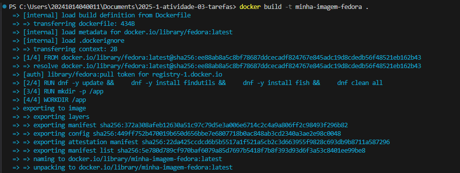
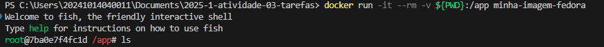
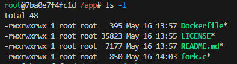
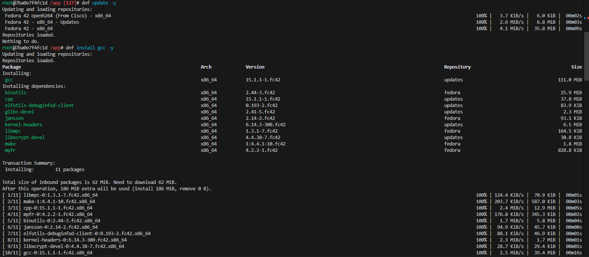
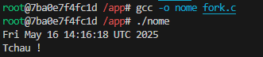
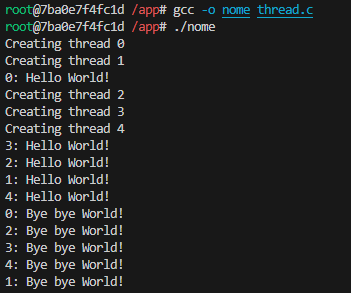

# S.O. 2025.1 - Atividade 03 - Compilação de código dentro de docker fedora

## Informações gerais

- **Objetivo do repositório**: Repositório para atividade avaliativa dos alunos
- **Assunto**: Implementação de tarefas (processos)
- **Público alvo**: alunos da disciplina de SO (Sistemas Operacionais) do curso de TADS (Superior em Tecnologia em Análise e Desenvolvimento de Sistemas) no CNAT-IFRN (Instituto Federal de Educação, Ciência e Tecnologia do Rio Grande do Norte - Campus Natal-Central).
- disciplina: **SO** [Sistemas Operacionais](https://github.com/sistemas-operacionais/)
- professor: [Leonardo A. Minora](https://github.com/leonardo-minora)
- aluno: [Ícaro Gabriel Pereira Carvalho](https://github.com/IcaroGabrielIcaro)

## Sumário

1. Tutorial introdutório de Dockerfile
2. Prática

---

## Parte 1. Tutotirla introdutório de Dockerfile

**Tutorial Introdutório a Dockerfile** by [deepseek](https://chat.deepseek.com/).

Neste tutorial, você aprenderá os conceitos básicos de **Dockerfile**, como criar uma imagem personalizada e executar um container com mapeamento de volumes.  

---

### 1.1. O que é um Dockerfile?
Um **Dockerfile** é um arquivo de texto que contém instruções para construir uma imagem Docker. Essas instruções definem:  
- A **imagem base** (ex: `fedora`, `ubuntu`, `python`).  
- **Comandos** a serem executados (instalação de pacotes, configurações).  
- **Diretórios de trabalho** e **variáveis de ambiente**.  
- **Mapeamento de portas** e **volumes**.  

---

### 1.2. Criando Nosso Primeiro Dockerfile

#### 1.2.1. Crie um arquivo `Dockerfile`
Abra um editor de texto (VS Code, Notepad++, etc.) e cole o seguinte conteúdo:  

```dockerfile
# Define a imagem base (Fedora)
FROM fedora:latest

# Atualiza os pacotes e instala utilitários básicos
RUN dnf -y update && \
    dnf -y install findutils && \
    dnf -y install fish && \
    dnf clean all

# Cria um diretório para a aplicação
RUN mkdir -p /app

# Define o diretório de trabalho padrão
WORKDIR /app

# Comando padrão ao iniciar o container
CMD ["fish"]
```

#### 1.2.2: Entendendo as Instruções
- **`FROM`**: Define a imagem base (aqui, usamos Fedora).  
- **`RUN`**: Executa comandos dentro do container (atualizar pacotes, instalar programas).  
- **`WORKDIR`**: Define o diretório padrão onde comandos serão executados.  
- **`CMD`**: Define o comando padrão ao iniciar o container (`bash` abre um terminal interativo).  

---

### 1.3. Construindo a Imagem Docker

No terminal (PowerShell ou CMD), navegue até a pasta onde está o `Dockerfile` e execute:  

```bash
docker build -t minha-imagem-fedora .
```
- **`-t minha-imagem-fedora`**: Define um nome para a imagem.  
- **`.`**: Indica que o Dockerfile está no diretório atual.  

---

### 1.4. Executando o Container com Mapeamento de Volume

Para mapear uma pasta do Windows para dentro do container, use:  

#### 1.4.1. No PowerShell
```bash
docker run -it --rm -v ${PWD}:/app minha-imagem-fedora
```

#### 1.4.2. No CMD (Prompt de Comando)
```bash
docker run -it --rm -v %cd%:/app minha-imagem-fedora
```

#### 1.4.3. Explicação do Comando
- **`-it`**: Modo interativo (permite digitar comandos no terminal do container).  
- **`--rm`**: Remove o container automaticamente após sair.  
- **`-v ${PWD}:/app`**: Mapeia o diretório atual do Windows (`${PWD}` ou `%cd%`) para `/app` no container.  

---

### 1.5. Verificando o Funcionamento

Dentro do container, execute:  
```bash
ls
```
Você verá os arquivos do seu diretório Windows mapeados em `/app`.  

Para sair do container, digite:
```bash
exit
```

---

### 1.6. Próximos Passos
Agora que você já sabe criar um Dockerfile básico, pode:  
✅ **Instalar outras dependências** (ex: `RUN dnf install gcc`)  
✅ **Expor portas** (ex: `EXPOSE 80`) para aplicações web  
✅ **Copiar arquivos** (ex: `COPY . /app`)  
✅ **Definir variáveis de ambiente** (ex: `ENV VAR=valor`)  

---

### 1.7. Conclusão
Você aprendeu:  
✔ Como criar um **Dockerfile**  
✔ Como **construir uma imagem** Docker  
✔ Como **mapear pastas** do Windows para o container  
✔ Como **executar e interagir** com o container  


### 🔗 1.8. Recursos Úteis
- [Documentação Oficial do Dockerfile](https://docs.docker.com/engine/reference/builder/)  
- [Tutoriais Docker para Iniciantes](https://docker-curriculum.com)  


---


## Parte 2. Prática

### 2.1. Introdução
Nesta prática, você aprenderá a usar um **Dockerfile** para criar um ambiente isolado capaz de **compilar e executar código em C**. O objetivo é:  
- Criar uma imagem Docker com as ferramentas necessárias (`gcc`).  
- Mapear um diretório do host (Windows/Linux) para o container.  
- Compilar e executar um programa em C diretamente no container.  

**Pré-requisitos:**  
✔ Docker instalado ([Download Docker Desktop](https://www.docker.com/products/docker-desktop))  
✔ Editor de texto (VS Code, Sublime, etc.)  
✔ Conhecimento básico de C  

---

### 2.2. Desenvolvimento das Atividades

#### 2.2.1. Fork e indentificação do aluno

1. Fork desse repositório para seu pessoal (de estudo).
2. Modifique o README procurando por FIXME na linha 10 por seu nome (coloque link para sua conta github).
3. Realize as atividades abaixo.

#### 2.2.2. Preparando o Ambiente
1. Crie uma pasta no seu sistema (ex: `docker-c-practice`).  
2. Dentro dela, crie dois arquivos:  
   - `Dockerfile` (instruções para a imagem Docker).  
   - copie corretamente os códigos-fonte do [capítulo de implementação de tarefa do livro texto da disciplina](https://wiki.inf.ufpr.br/maziero/lib/exe/fetch.php?media=socm:socm-05.pdf)

#### 2.2.3. Conteúdo do `Dockerfile`

Veja tutorial acima e crie seu Dockerfile no mesmo diretório dos códigos-fonte


#### 2.2.4. Construindo a Imagem Docker

Veja tutorial acima e construa a sua imagem docker.

#### 2.2.5. Executando o Container

Veja tutorial acima e execute o tutorial.

Lembre:
1. instalar o `gcc`.
2. você esta no terminal `fish`, ele tentará te ajudar.
3. você esta no diretório `app` do conteiner que é uma referência para o diretório que está o Dockerfile e os códigos-fonte em c do Windows.

Para **compilar e executar** seus códigos-fontes.  
```bash

```

---

### 2.3. Relatório da Prática (Template para Entregar)

**Lembre** que o relatório:
- deve estar no mesmo repositório, 
- deve ser em markdown, 
- deve conter imagens da tela capturada,
- apesar da atividade ser coletiva, relatório deve ser individual.

**Nome:** ícaro Gabriel Pereira Carvalho
**Data:** 16/05/2025

### **1. Objetivo**  
O objetivo da prática, de forma breve, foi utilizar o Dockerfile para criar um ambiente isolado e poder rodar os códigos em C vistos na aula passada. O Dockerfile em questão está configurado para fornecer uma imagem básica do Fedora e o shell Fish, sendo necessário instalar um compilador C, o `gcc`, com os comandos vistos na atividade passada para o correto funcionamento.

Agora, com o funcionamento dos códigos, é possível criar processos filhos com o `fork()`, executar outros programas com o `execve()` e sincronizar a execução do processo pai e do filho, além de criar múltiplas threads — ambos os conceitos foram abordados na aula passada.

---

### **2. Passos Executados**  

- **Comando 1**: `docker build -t minha-imagem-fedora .`  
  Esse comando cria uma nova imagem Docker com o nome `minha-imagem-fedora` a partir do Dockerfile no diretório atual.  
  

- **Comando 2**: `docker run -it --rm -v ${PWD}:/app minha-imagem-fedora`  
  Esse comando executa um contêiner Docker de forma interativa, com um volume compartilhado entre o contêiner e o host, removendo o contêiner automaticamente após o término.  
  

- **Comando 3**: `ls -l`  
  Uso o comando para ver informações detalhadas sobre os arquivos e diretórios que estão disponíveis.  
  

- **Comandos 4 e 5**: `dnf update -y | dnf install gcc -y`  
  Primeiro, atualizo todos os pacotes instalados para as versões mais recentes e depois instalo o compilador `gcc`, necessário para compilar programas em C.  
  

- **Comandos 6 e 7**: `gcc -o nome fork.c | ./nome`  
  Primeiro, compilo o código-fonte `fork.c` e gero um executável chamado "nome", para então executar o programa gerado com o nome "nome".  
  

---

### **3. Resultados Obtidos**  

- **Primeiro Programa: `fork.c`**  
  

  O código em questão utiliza a função `fork()` para criar um processo filho. O processo pai espera que o filho termine antes de continuar a execução, utilizando a função `wait()`. O processo filho, ao ser criado, executa o comando `/bin/date` por meio da função `execve()`, o que faz com que o processo filho seja substituído pela execução do comando, exibindo a data e hora atual.

  Após a execução do `execve()`, o processo filho exibe a data e ambos os processos (pai e filho) imprimem a mensagem "Tchau !".

  **Problemas enfrentados e soluções**:  
  A saída esperada seria:
  Fri May 16 14:16:18 UTC 2025
  Tchau !
  Tchau !
  
  O motivo de ver apenas um "Tchau !" é que o processo filho foi substituído pelo comando `date` após a execução do `execve()`, e não executou o `printf("Tchau !")`. Apenas o processo pai imprimiu o "Tchau !". Para ambos imprimirem, o `printf("Tchau !")` deve ser colocado antes do `execve()` no processo filho.

---

- **Segundo Programa: `thread.c`**  


O código cria 5 threads, cada uma imprimindo "Hello World!", aguardando 5 segundos e depois imprimindo "Bye bye World!". As threads são executadas concorrentemente, então a ordem de execução e impressão das mensagens pode variar, mas cada thread segue o mesmo padrão de execução.

**Problemas enfrentados e soluções**:  
Aparentemente não houveram problemas.

---

### **4. Conclusão**  

Os códigos demonstram conceitos fundamentais de concorrência e paralelismo, como a criação de processos com `fork()` e `execve()`, que permitem a execução paralela de tarefas, e o uso de threads com `pthread_create()` para executar múltiplas partes de um programa simultaneamente dentro de um processo. Também abordam a importância da sincronização com `wait()` e `pthread_exit()`, garantindo a execução correta dos processos e threads. Esses códigos foram executados dentro de um ambiente isolado gerado pelo Dockerfile, que garantiu a consistência e portabilidade do código. O uso de Docker facilita o desenvolvimento e testes, permitindo a criação de ambientes controlados, e esses conceitos são essenciais para construir sistemas eficientes, escaláveis e robustos.

Uma possível implementação desses conceitos seria em sistemas que exigem processamento paralelo ou distribuído, como servidores web ou aplicativos de alto desempenho. O uso de `fork()` e `execve()` pode ser útil em servidores que precisam criar processos independentes para atender múltiplas requisições simultâneas, enquanto o uso de threads pode ser vantajoso em aplicativos que necessitam de processamento em tempo real, como em sistemas de monitoramento ou processamento de dados em lote.
